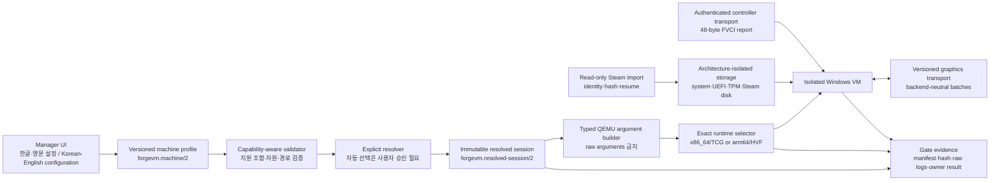

# ForgeVM MVP 로드맵 | ForgeVM MVP Roadmap

> **문서 ID | Document ID:** `FVM-MVP-ROADMAP-DP-1.0`  
> **공개 범위 | Public scope:** MVP M0–M13 only  
> **상태 기준일 | Status snapshot:** 2026-07-30  
> **단계 | Phase:** Feasibility MVP  
> **공개 상태 | Publication status:** Approved for public release — 2026-07-30 KST  
> **권리 | Rights:** Copyright © 2026 Facta-Leopard. See [`LICENSE`](LICENSE).

이 저장소는 ForgeVM의 **MVP 로드맵만** 공개하기 위한 독립 공개
저장소다. 이 문서는 내부 개발지시서 `FVM-MVP-DIRECTIVE-2.0`을 바탕으로
M0–M13의 목표, 기술 설계, 검증 Gate와 현재 상태를 한글·영어 통합본으로
기록한다. 전체 제품 로드맵, 포스트 MVP 계획, 내부 운영 문서와 source
code는 이 공개 범위에 포함하지 않는다.

This standalone public repository is intended to publish **only the ForgeVM
MVP roadmap**. Based on the internal `FVM-MVP-DIRECTIVE-2.0`, this bilingual
document records the goals, technical design, verification Gates, and current
status of M0–M13. The full-product roadmap, post-MVP plans, internal operating
documents, and source code are outside this publication scope.

## 공개 목적과 한계 | Publication purpose and limits

이 문서는 공개 시점을 명확히 남기고 아래에 설명된 MVP 기술 구성을
방어적으로 공개한다. 실제 최초 공개일은 GitHub commit, 공개 URL과
`PUBLICATION_RECORD.md`에 기록한다.

This document defensively publishes the MVP technical configuration described
below with an unambiguous publication record. The GitHub commit, public URL,
and `PUBLICATION_RECORD.md` record the actual first publication.

이 문서의 공개는 특정 특허의 유효성, 특허 침해 부재, 실시 자유 또는
제3자의 독립 구현을 막을 수 있음을 보증하지 않는다. 공개 전에 특허로
먼저 보호할 후보가 있다면 그 부분은 출원 여부를 먼저 결정해야 한다.
공개된 구체적 내용은 이후 특허 신규성 판단에서 선행기술로 취급될 수
있고, 그 결과 소유자 자신의 후출원도 제한될 수 있다.

Publication does not guarantee patent validity, non-infringement, freedom to
operate, or the ability to prevent independent implementation by others. Any
candidate that should be protected by a patent first must be screened before
publication. The concrete subject matter disclosed here may later be treated
as prior art and may also restrict the owner's own later filings.

## MVP가 답해야 하는 질문 | The MVP question

ForgeVM은 다음 두 전체 시스템 경로를 동일한 증거 형식으로 비교한다.

ForgeVM compares two full-system paths using the same evidence format.

| 프로필 | 허용되는 조합 | 실험 목적 |
|---|---|---|
| x86-64 | Windows x64 + `qemu-system-x86_64` + TCG | 실제 x86-64 Windows kernel과 x64 driver가 필요한 게임 경로의 기능·성능을 측정<br>Measure functionality and performance for a real x86-64 Windows kernel and x64-driver game path |
| Arm64 | Windows Arm64 + `qemu-system-aarch64` + HVF | Same-ISA acceleration을 사용하는 비교 경로를 측정<br>Measure the comparison path using same-ISA acceleration |

`x86_64 + HVF`, `arm64 + TCG`, silent fallback과 임의 QEMU arguments는
지원 조합이 아니다.

`x86_64 + HVF`, `arm64 + TCG`, silent fallback, and arbitrary QEMU
arguments are not supported combinations.

MVP는 다음 중 하나의 상태에 도달해야 한다.

The MVP must reach one of these states:

| 완료 상태 | 의미 |
|---|---|
| `TEST_READY` | 사용자가 게스트 Steam에서 선택한 게임을 직접 실행하고 환경·결과를 기록할 수 있음<br>The owner can launch a selected game in guest Steam and record the environment and outcome |
| `FEASIBILITY_BLOCKED` | 사용자 테스트 전에 막는 필수 장벽과 시도한 대안이 재현 가능한 evidence로 확정됨<br>A mandatory barrier before owner testing, including attempted alternatives, is established with reproducible evidence |

두 상태 모두 M12의 소유자 입력과 M13의 명시적 결정을 대신하지 않는다.

Neither state replaces owner input at M12 or an explicit decision at M13.

## 현재 상태 | Current status

| 마일스톤 | 구현 스냅샷 | Gate 해석 |
|---|---|---|
| M0 | `IN_PROGRESS` | v2 status report는 `execution=inProgress`, `outcome=notEvaluated`다.<br>The v2 status report is `execution=inProgress`, `outcome=notEvaluated`. |
| M1 | `IN_PROGRESS` | Dual-target 구현이 일부 존재하지만 v2 M1 `PASS` report가 없다.<br>Some dual-target implementation exists, but there is no v2 M1 `PASS` report. |
| M2 | `IN_PROGRESS` | Manager/profile/localization 구현이 일부 존재하지만 v2 M2 `PASS` report가 없다.<br>Some Manager, profile, and localization implementation exists, but there is no v2 M2 `PASS` report. |
| M3 | `IN_PROGRESS`; classification `GPTK_REFERENCE_ONLY` | 공개 VM integration 계약이 없다는 현재 판정이며 direct backend 성공이 아니다.<br>The current finding is that no public VM integration contract is established; it is not a direct-backend success. |
| M4 | `NOT_VERIFIED` | Windows x64/Arm64 설치·부팅 evidence가 없다.<br>There is no Windows x64/Arm64 installation and boot evidence. |
| M5 | `PARTIAL_HOST_ONLY` | Host storage/import 구성 요소는 guest NTFS transport를 증명하지 않는다.<br>Host storage/import components do not prove guest NTFS transport. |
| M6 | `PARTIAL_HOST_ONLY` | Host controller capture는 Windows virtual controller evidence가 아니다.<br>Host controller capture is not Windows virtual-controller evidence. |
| M7–M10 | `NOT_TEST_READY` | Guest graphics path와 integrity experiment가 종단 검증되지 않았다.<br>The guest graphics path and integrity experiment are not verified end to end. |
| M11–M13 | `NOT_TESTED` | Steam/game owner test와 최종 결정이 없다.<br>There is no Steam/game owner test or final decision. |

현재 상태는 비공개 기준 자료 `FVM-MVP-DIRECTIVE-2.0 §1.4`,
`M0-v2-Status`, `M3-Status`를 2026-07-30에 대조해 작성했다. 이 공개
저장소는 그 내부 문서나 경로를 공개하지 않는다.

The current status was reconciled on 2026-07-30 against the private baseline
records `FVM-MVP-DIRECTIVE-2.0 §1.4`, `M0-v2-Status`, and `M3-Status`.
This public repository does not publish those internal documents or paths.

## 실행 원칙 | Execution rules

- 각 기술 마일스톤은 원칙적으로 이전 Gate의 `PASS`에 의존한다.
- Each technical milestone depends on a preceding `PASS` Gate.
- 미래 모듈을 위한 interface 작업과 해당 기능의 완료 주장을 구분한다.
- Interface preparation for a future module is separate from claiming that
  module is complete.
- 실패한 Gate는 결과를 숨기지 않고 M13 evidence로 보존한다.
- A failed Gate remains visible and is preserved as M13 evidence.
- `CONDITIONAL`은 최대 세 개의 이름 붙은 실험만 승인할 수 있다.
- `CONDITIONAL` may authorize at most three named experiments.
- 날짜나 출시 약속보다 재현 가능한 exit Gate가 우선한다.
- Reproducible exit Gates take precedence over calendar or release promises.

## MVP 기술 공개 기준선 | MVP technical disclosure baseline

이 절은 단순한 일정 약속이 아니라 MVP가 채택한 시스템 구성과 작동
규칙을 공개한다. `현재 구현`은 2026-07-30 기준 host-side source에서
확인된 범위이고, `설계 공개`는 향후 M0–M13에서 구현·검증할 구체적인
구성이다. 설계가 공개되었다는 사실은 구현 또는 Gate 통과를 뜻하지
않는다.

This section discloses the MVP system configuration and operating rules, not
merely a schedule. `Current implementation` means the scope observed in
host-side source as of 2026-07-30. `Disclosed design` means a concrete
configuration intended for implementation and verification during M0–M13.
Disclosure of a design does not mean that it has been implemented or passed a
Gate.

### 1. 전체 시스템 구성 | End-to-end system composition



핵심 결합은 “사용자 설정 → 검증 → 명시적 해석 → immutable session →
typed launch → 증거”다. UI 값이나 host 기본값이 runtime에서 몰래
바뀌지 않으며, 자동 값은 session 생성 전에 구체적인 값으로 해석된다.

The core chain is “user configuration → validation → explicit resolution →
immutable session → typed launch → evidence.” UI values or host defaults do
not change silently at runtime; automatic values become concrete before the
session is created.

### 2. Architecture와 실행 엔진 결정 | Architecture and execution-engine decision

MVP architecture matrix의 schema는 `forgevm.architecture-matrix/2`다.
동시에 실행할 수 있는 session은 하나이며, raw QEMU arguments와
accelerator fallback은 허용하지 않는다.

The MVP architecture matrix uses schema
`forgevm.architecture-matrix/2`. Only one session may be active at a time;
raw QEMU arguments and accelerator fallback are prohibited.

| Guest architecture | 유일하게 허용되는 engine | QEMU target / executable | CPU 정책 | 추가 규칙 |
|---|---|---|---|---|
| `x86_64` | `tcg` | `x86_64-softmmu` / `qemu-system-x86_64` | 검증된 preset / validated preset | `auto`, `single`, `multi` TCG mode; system disk 공유 금지 |
| `arm64` | `hvf` | `aarch64-softmmu` / `qemu-system-aarch64` | `host` | TCG field 금지; system disk 공유 금지 |

결정 절차는 다음과 같다.

The decision procedure is:

```text
pair := (profile.guestArchitecture, profile.executionEngine)
require pair ∈ {(x86_64, tcg), (arm64, hvf)}
require no other active session
require rawQemuArguments == absent

if pair == (x86_64, tcg):
    require CPU model ∈ validated x86 presets
    resolve TCG thread mode to single or multi
    require host MTTCG support and vCPU >= 2 when mode == multi
else:
    require CPU model == host
    require TCG thread mode and translation cache == absent

select the exact executable for pair
on any mismatch: fail before process launch
never retry with another engine or architecture
```

이 구성은 Arm64/HVF 성공을 x86-64/TCG 성공으로 대체하지 않으며, 한
경로의 실패도 다른 경로로 조용히 우회하지 않는다.

An Arm64/HVF success never substitutes for x86-64/TCG success, and failure of
one path never silently redirects execution to the other.

### 3. Profile 검증과 immutable session | Profile validation and immutable session

사용자 설정은 versioned `forgevm.machine/2` profile에 저장한다. profile은
guest, execution, CPU, memory, storage, firmware, graphics, input, audio,
network와 diagnostics를 소유한다. validator는 적어도 다음을 함께
검사한다.

User configuration is stored in a versioned `forgevm.machine/2` profile. The
profile owns guest, execution, CPU, memory, storage, firmware, graphics,
input, audio, network, and diagnostics configuration. The validator checks at
least the following together:

- architecture/engine pair와 CPU model/topology/vCPU의 정합성  
  consistency of the architecture/engine pair, CPU model, topology, and vCPU;
- TCG mode, MTTCG host capability, translation cache 범위
  `16...4096 MiB`  
  TCG mode, host MTTCG capability, and translation-cache range
  `16...4096 MiB`;
- guest memory `4096...1048576 MiB`, host reserve
  `1024...1048576 MiB`, 실제 host memory budget  
  guest memory `4096...1048576 MiB`, host reserve
  `1024...1048576 MiB`, and the real host-memory budget;
- system disk `64...8192 GiB`, Steam disk `0...32768 GiB`, bookmark,
  volume identity와 import field의 묶음 관계  
  system disk `64...8192 GiB`, Steam disk `0...32768 GiB`, bookmarks,
  volume identity, and the all-or-none relationships among import fields;
- graphics backend availability, display geometry와 host-visible memory  
  graphics-backend availability, display geometry, and host-visible memory;
- UEFI, Secure Boot, TPM 2.0, controller ownership과 Bluetooth device identity  
  UEFI, Secure Boot, TPM 2.0, controller ownership, and Bluetooth-device
  identity.

검증을 통과한 profile도 `auto` 값을 그대로 실행하지 않는다. resolver는
다음 규칙으로 `forgevm.resolved-session/2` snapshot을 만든다.

Even a valid profile does not execute unresolved `auto` values. The resolver
creates a `forgevm.resolved-session/2` snapshot using these rules:

```text
validate(profile, hostCapabilities)

if x86_64/TCG and threadMode == auto:
    require an explicit selected mode
if selected mode == multi:
    require host.supportsMTTCG && vCPU >= 2

translationCache :=
    host.defaultTCGCacheMiB  when configured value == 0
    configured value         otherwise
require translationCache in 16...4096 MiB

if graphicsBackend == automatic:
    require a concrete backend selection
    require explicit user approval of that automatic resolution
require selected backend in host.supportedGraphicsBackends

runtimeOverheadMiB :=
    host.baseRuntimeOverheadMiB
    + resolvedTCGCacheMiB_or_0
    + graphics.hostVisibleMemoryMiB

estimatedHostCommitmentMiB :=
    guestMemoryMiB + hostReserveMiB + runtimeOverheadMiB

emit immutable session ID, machine ID, timestamp, resolved values,
host-capability snapshot, and validation warnings
```

이 snapshot이 launch와 evidence의 공통 입력이다. 따라서 나중에 host
기본값이 바뀌어도 이미 기록된 실험의 실제 선택값을 재구성할 수 있다.

This snapshot is the common input to launch and evidence. A recorded
experiment can therefore be reconstructed even if host defaults later change.

### 4. Typed QEMU launch boundary | Typed QEMU 실행 경계

runtime builder는 resolved session만 입력으로 받고 architecture별 exact
executable을 선택한다. 사용자가 임의 문자열을 추가하는 경로는 MVP에
없다. builder가 생성하는 공통 argument 범주는 다음과 같다.

The runtime builder accepts only the resolved session and selects the exact
architecture-specific executable. The MVP exposes no path for user-supplied
argument strings. The builder emits these common argument categories:

| 범주 | 생성 규칙 |
|---|---|
| CPU | architecture에 맞는 allow-listed model; x86 TCG mode/cache는 이미 resolve된 값만 사용 |
| Topology | `cpus`, `sockets`, `cores`, `threads`를 profile topology에서 함께 생성 |
| Memory | resolved guest memory를 MiB 단위로 전달 |
| Device baseline | `-nodefaults` 후 명시적 `ramfb`와 선택된 display mode 사용 |
| Control | serial/monitor 비활성화, session별 Unix QMP socket 사용 |
| Failure behavior | no-reboot, session별 QEMU log, 필요 시 paused start |

지원하지 않는 schema, architecture/engine pair, 누락되거나 불필요한 TCG
field, cache 범위 초과 또는 CPU preset 불일치는 process를 시작하기 전에
stable diagnostic code로 실패한다.

Unsupported schemas, execution pairs, missing or unexpected TCG fields,
out-of-range cache values, and incompatible CPU presets fail with stable
diagnostic codes before a process starts.

### 5. VM 저장소의 identity와 atomic publication | VM-storage identity and atomic publication

각 machine은 `forgevm.machine-storage/1` 상태와 architecture 전용 bundle을
사용한다. 기본 disk role은 qcow2 system disk와 선택적 Steam data
disk이며, system disk·UEFI·TPM·쓰기 가능한 Steam disk는 서로 다른 guest
architecture 사이에서 공유하지 않는다.

Each machine uses `forgevm.machine-storage/1` state and an
architecture-specific bundle. The baseline disk roles are a qcow2 system disk
and an optional Steam data disk. System disks, UEFI state, TPM state, and
writable Steam disks are never shared across guest architectures.

Provisioning 절차는 다음 순서를 공개 기준선으로 삼는다.

The disclosed provisioning baseline is:

1. 사용자가 선택한 root bookmark를 resolve하고 실제 volume UUID를
   확인한다.  
   Resolve the user-selected root bookmark and verify the actual volume UUID.
2. symlink, root escape, 기존 machine collision과 잘못된 identity를
   거부한다.  
   Reject symlinks, root escapes, existing-machine collisions, and mismatched
   identity.
3. 최종 경로 밖의 private staging bundle을 만들고 권한을 `0700`으로
   제한한다.  
   Create a private staging bundle outside the final path with `0700`
   permissions.
4. `qemu-img`로 요청된 virtual size의 qcow2 image를 만들고 tool output의
   format과 size를 다시 검증한다.  
   Create qcow2 images at the requested virtual sizes with `qemu-img`, then
   verify the reported format and size.
5. versioned state를 저장하고 대상 volume identity를 다시 resolve한다.  
   Persist versioned state and re-resolve the destination volume identity.
6. identity가 처음과 같을 때만 staging bundle을 final path에 원자적으로
   publish한다. 실패하면 불완전한 bundle을 정상 machine으로 노출하지
   않는다.  
   Atomically publish the staging bundle only if the identity still matches.
   A failure never exposes an incomplete bundle as a valid machine.

외장 volume이 분리되거나 identity가 바뀌면 다른 위치로 조용히 옮기지
않고 명시적 relink 또는 중단을 요구한다.

If an external volume detaches or changes identity, the system requires an
explicit relink or stop instead of silently relocating the machine.

### 6. 원본 무변경 Steam 가져오기 | Non-mutating Steam import

host의 기존 Steam library는 credential source나 writable VM disk가 아니라
읽기 전용 import source다. scanner는 선택된 game manifest와 content
root를 찾고 root 및 각 file의 device/file identity를 기록한다.

An existing host Steam library is a read-only import source, not a credential
source or writable VM disk. The scanner identifies the selected game manifest
and content root and records device/file identity for the root and files.

Import planner와 engine의 공개 규칙은 다음과 같다.

The disclosed planner and engine rules are:

- symlink와 source-root escape를 거부하고 최대 `2,000,000` entries만
  계획한다.  
  Reject symlinks and source-root escapes and plan at most `2,000,000`
  entries.
- control character, Windows reserved name, Windows-invalid character,
  Unicode NFC/case-fold destination collision을 사전에 거부한다.  
  Reject control characters, Windows reserved names, Windows-invalid
  characters, and Unicode NFC/case-fold destination collisions before copy.
- directory를 file보다 먼저 정렬하여 destination을 결정적으로 만든다.  
  Sort directories before files for deterministic destination creation.
- 기본 `4 MiB` chunk로 exact offset에 기록하고, 시작 전·복사 중·완료
  후 source identity를 다시 확인한다.  
  Write default `4 MiB` chunks at exact offsets and revalidate source identity
  before, during, and after transfer.
- resume 시 destination prefix SHA-256과 같은 길이의 source prefix
  SHA-256이 일치할 때만 이어 쓰며, 완료 후 size와 full SHA-256을
  검증한다.  
  Resume only when destination-prefix SHA-256 equals source-prefix SHA-256 for
  the same length, then verify final size and full SHA-256.

현재 host-side transport는 source inventory hash를 포함한 immutable
`UDF 1.50` image를 staging에서 생성하고 `0444` read-only 권한으로
원자적으로 publish하며, receipt schema
`forgevm.steam-udf-import-receipt/1`에 source/image identity와 hash를
기록한다.

The current host-side transport builds an immutable `UDF 1.50` image in
staging, atomically publishes it with `0444` read-only permissions, and
records source/image identity and hashes in receipt schema
`forgevm.steam-udf-import-receipt/1`.

**현재 경계:** 이 image는 transfer media일 뿐 guest-owned NTFS로의 복사,
guest Steam library 등록 또는 game compatibility를 구현·증명하지
않는다. 이 작업은 M5와 M11의 미완료 Gate다.

**Current boundary:** The image is transfer media only. It neither implements
nor proves copying into guest-owned NTFS, registration with guest Steam, or
game compatibility. Those remain unfinished M5 and M11 Gates.

### 7. Controller report와 session identity 분리 | Separation of controller report and session identity

고빈도 controller state는 fixed-width little-endian `FVCI` report version
1로 표현한다. controller UUID, 인증과 connect/disconnect lifecycle은
별도의 authenticated session transport가 소유하며, 48-byte report에는
input state만 넣는다.

High-frequency controller state uses fixed-width little-endian `FVCI` report
version 1. Controller UUID, authentication, and connect/disconnect lifecycle
belong to a separate authenticated session transport; the 48-byte report
contains input state only.

| Byte offset | Size | Field |
|---:|---:|---|
| 0 | 4 | ASCII magic `FVCI` |
| 4 | 2 | version = `1` |
| 6 | 2 | declared size = `48` |
| 8 | 8 | monotonically increasing sequence |
| 16 | 8 | monotonic timestamp in nanoseconds |
| 24 | 4 | button bitset |
| 28 | 8 | four signed 16-bit stick axes |
| 36 | 4 | two unsigned 16-bit triggers |
| 40 | 2 | ternary signed 8-bit D-pad X/Y (`-1`, `0`, `1`) |
| 42 | 6 | reserved, zero-filled |

decoder는 exact size, magic, version과 declared size를 먼저 검증한다.
현재 host capture와 codec은 존재하지만 Windows virtual HID/XInput
device가 report를 소비하고 guest가 이를 관찰했다는 evidence는 아직
없다.

The decoder first validates exact size, magic, version, and declared size.
Host capture and the codec currently exist, but there is no evidence yet that
a Windows virtual HID/XInput device consumes the report and is observed by
the guest.

### 8. Graphics transport와 backend 분리 | Graphics transport/backend separation

graphics는 guest protocol, host transport, renderer backend와 사용자 모드
API layer를 서로 다른 책임으로 분리한다.

Graphics separates guest protocol, host transport, renderer backend, and the
user-mode API layer into distinct responsibilities.

| 계층 | 소유 범위 | 금지되는 결합 |
|---|---|---|
| Guest x64/Arm64 transport | architecture별 virtual-device client와 package | host pointer, Metal/GPTK 내부 형식 |
| Host graphics transport | version negotiation, bounded queue, resource ownership/quota, fences, reset, validation | Metal, GPTK, Direct3D, game/storefront-specific logic |
| Renderer backend | validated backend-neutral batch를 host GPU work로 변환 | guest protocol ownership |
| Guest user-mode layer | 선택 game에 필요한 최소 Direct3D API를 transport command로 변환 | private host API 또는 game-name exception |

backend kind는 `softwareReference`, `gptkEvaluation`, `forgeMetal`이고
support level은 `unavailable`, `experimental`, `preview`, `supported`다.
capability에는 지원 API(`displayOnly`, Direct3D 9/10/11/12),
direct-presentation 여부, guest-transport 여부와 diagnostic code가
포함된다. 자동 backend도 사용자의 명시적 승인 없이 선택하지 않으며,
`unavailable` backend를 다른 backend로 fallback하지 않는다.

Backend kinds are `softwareReference`, `gptkEvaluation`, and `forgeMetal`;
support levels are `unavailable`, `experimental`, `preview`, and `supported`.
Capabilities include supported APIs (`displayOnly`, Direct3D 9/10/11/12),
direct presentation, guest transport, and diagnostic codes. Even an automatic
backend requires explicit user approval, and an `unavailable` backend never
falls back to another backend.

현재 capability contract와 explicit-selection policy는 host side에
존재한다. Versioned guest/host command queue, Windows driver, Direct3D
user-mode layer와 game-grade renderer는 M7–M10 설계 공개이며 아직 종단
구현 evidence가 없다.

The capability contract and explicit-selection policy currently exist on the
host side. The versioned guest/host command queue, Windows driver, Direct3D
user-mode layer, and game-grade renderer are disclosed M7–M10 designs with no
end-to-end implementation evidence yet.

### 9. Evidence와 상태 상승 규칙 | Evidence and status advancement

각 Gate result는 성공 여부만 기록하지 않고 다음을 같은 evidence
envelope에 묶는다.

Each Gate result binds more than a success flag into the same evidence
envelope:

- source/dependency/tool version과 artifact SHA-256  
  source, dependency, and tool versions plus artifact SHA-256;
- immutable resolved session과 host capability snapshot  
  immutable resolved session and host-capability snapshot;
- architecture, engine, CPU/topology/memory, storage identity, graphics
  backend와 integrity state  
  architecture, engine, CPU/topology/memory, storage identity, graphics
  backend, and integrity state;
- raw logs, 실행한 test, 실행하지 못한 test와 blocker  
  raw logs, executed tests, unexecuted tests, and blockers;
- 자동화가 만들지 않은 M12 owner verdict와 provenance  
  the M12 owner verdict and provenance, never manufactured by automation.

`execution`과 `outcome`은 별도 field다. 코드가 존재하거나 test가 일부
통과해도 authoritative Gate가 `execution=completed`와 `outcome=pass`를
함께 기록하지 않으면 milestone은 완료가 아니다. 실패도 configuration,
logs와 시도한 범위 내 대안을 보존했을 때 재현 가능한 M13 evidence가
된다.

`execution` and `outcome` are separate fields. Existing code or partial test
success does not complete a milestone unless the authoritative Gate records
both `execution=completed` and `outcome=pass`. A failure becomes reproducible
M13 evidence only when its configuration, logs, and attempted in-scope
alternatives are preserved.

### 10. 공개된 조합의 경계 | Boundaries of the disclosed combination

이 문서가 공개하는 핵심 조합은 다음과 같다.

The core disclosed combination is:

1. 한 Manager가 서로 대체 불가능한 x86-64/TCG와 Arm64/HVF full-system
   path를 같은 evidence model로 비교한다.  
   One Manager compares non-substitutable x86-64/TCG and Arm64/HVF
   full-system paths using one evidence model.
2. versioned profile을 capability-aware validation과 owner-approved
   resolution을 거쳐 immutable session으로 고정한 뒤 typed launch를
   만든다.  
   A versioned profile passes capability-aware validation and owner-approved
   resolution into an immutable session before typed launch construction.
3. architecture별 VM identity/storage를 분리하고 external-volume identity,
   staging verification과 atomic publication으로 incomplete state 노출을
   막는다.  
   Architecture-specific VM identity/storage combines external-volume
   identity, staging verification, and atomic publication to avoid exposing
   incomplete state.
4. 기존 Steam content를 읽기 전용으로 inventory하고 identity/hash-safe
   resume와 immutable transfer media를 거쳐 guest-owned NTFS로 옮기는
   경로를 사용한다.  
   Existing Steam content is inventoried read-only and moved toward
   guest-owned NTFS through identity/hash-safe resume and immutable transfer
   media.
5. authenticated controller lifecycle과 compact fixed-width state report를
   분리하고, backend-neutral bounded graphics transport를 renderer와
   분리한다.  
   Authenticated controller lifecycle is separated from a compact fixed-width
   state report, while a bounded backend-neutral graphics transport is
   separated from the renderer.
6. 어떤 경로도 silent fallback, VM identity concealment, anti-cheat bypass
   또는 확인되지 않은 성공 주장으로 결과를 바꾸지 않는다.  
   No path changes the result through silent fallback, VM-identity
   concealment, anti-cheat bypass, or an unverified success claim.

---

## M0 — 재기준 설정 | Rebaseline

- **상태 | Status:** `IN_PROGRESS`; `outcome=notEvaluated`
- **목표 | Goal:** x86-64/TCG와 Arm64/HVF를 독립된 MVP 경로로 고정하고
  v1 가정을 재분류한다.  
  Establish x86-64/TCG and Arm64/HVF as independent MVP paths and reclassify
  the v1 assumptions.
- **핵심 산출물 | Core deliverables:** ADR-0004, machine-readable
  architecture matrix, module ownership, risk register, dependency/license
  inventory, v1-to-v2 reclassification.
- **완료 Gate | Exit Gate:** 코드·테스트·문서가 두 조합과 금지 조합을
  모순 없이 표현하고, ForgePlay dependency 및 허위 완료 표시가 없다.  
  Code, tests, and documentation represent the two valid pairs and invalid
  pairs consistently, with no ForgePlay dependency and no false completion
  claim.
- **현재 근거 | Current evidence:** private records `ADR-0004`,
  `M0-v2-Status`, `Dependency-Inventory`, and
  `v1-to-v2-Reclassification`.
- **남은 핵심 작업 | Key remaining work:** v2-only Gate/registry 정합성,
  directive integrity 재생성, final source/tool/artifact binding.  
  Align the v2-only Gate and registry, regenerate directive integrity data,
  and finalize source/tool/artifact binding.

## M1 — Dual-target QEMU Runtime

- **상태 | Status:** `IN_PROGRESS`; no v2 `PASS` Gate
- **의존성 | Dependency:** M0 `PASS`
- **목표 | Goal:** 두 QEMU system target을 고정된 source와 option으로
  재현 가능하게 빌드·패키징한다.  
  Reproducibly build and package both QEMU system targets from pinned source
  and options.
- **핵심 산출물 | Core deliverables:** `qemu-system-x86_64`,
  `qemu-system-aarch64`, TCG/HVF capability probe, explicit engine selection,
  signed package metadata, failure diagnostics.
- **완료 Gate | Exit Gate:** x86-64가 TCG `single`과 `multi`를 각각
  증명하고 Arm64가 HVF를 증명하며, 잘못된 조합과 fallback은 실행 전에
  거부된다.  
  x86-64 proves TCG `single` and `multi`, Arm64 proves HVF, and invalid pairs
  and fallback are rejected before launch.
- **현재 근거 | Current evidence:** the private directive snapshot reports
  typed launch construction and a dual-binary artifact.
- **남은 핵심 작업 | Key remaining work:** bundled swtpm, exact source-lock
  alignment, reproducible build evidence, and an authoritative v2 Gate.

## M2 — Manager 설정·로컬라이징 | Manager configuration and localization

- **상태 | Status:** `IN_PROGRESS`; no v2 `PASS` Gate
- **의존성 | Dependency:** M1 `PASS`
- **목표 | Goal:** 사용자가 핵심 실험 변수를 한글/영문 GUI에서
  안전하게 구성하고 immutable session으로 해석하게 한다.  
  Let the user configure core experiment variables safely in Korean and
  English and resolve them into an immutable session.
- **핵심 산출물 | Core deliverables:** `forgevm.machine/2`, profile
  create/clone/edit/delete, capability display, CPU/topology/memory/storage
  validation, Korean/English String Catalog, resolved-session manifest.
- **완료 Gate | Exit Gate:** 두 언어의 전체 profile flow가 동작하고,
  invalid architecture/engine/resource 조합이 거부되며, resolved TCG mode가
  실제 QEMU arguments와 일치한다.  
  Both localized profile flows work, invalid architecture/engine/resource
  combinations are rejected, and the resolved TCG mode matches actual QEMU
  arguments.
- **현재 근거 | Current evidence:** machine schema, localized resources, UI,
  and launch coordination are reported as implemented in progress.
- **남은 핵심 작업 | Key remaining work:** package the current dual-target
  runtime and complete end-to-end user validation in both languages.

## M3 — GPTK 조기 평가와 Graphics 계약 | Early GPTK evaluation and graphics contract

- **상태 | Status:** `IN_PROGRESS`; current classification
  `GPTK_REFERENCE_ONLY`
- **의존성 | Dependency:** M2 `PASS`
- **목표 | Goal:** 선택된 GPTK 자료에 공개되고 허용된
  VM/out-of-process integration 계약이 있는지 조기에 판정하고, 다음
  graphics path를 고정한다.  
  Determine early whether the selected GPTK material exposes a documented and
  permitted VM/out-of-process integration contract, then fix the next graphics
  path.
- **핵심 산출물 | Core deliverables:** allow-listed inventory, exact-release
  and license evidence, architecture/signature hashes, documented API review,
  backend-neutral graphics contracts, one of
  `GPTK_DIRECT_EXPERIMENTAL`, `GPTK_REFERENCE_ONLY`, or `GPTK_REJECTED`.
- **완료 Gate | Exit Gate:** 판정이 실제 binary/document/license evidence에
  묶이고 private API나 reverse engineering에 의존하지 않으며, 판정 후
  graphics path가 명확하다.  
  The classification is bound to actual binary/document/license evidence,
  relies on neither private APIs nor reverse engineering, and leaves an
  explicit next graphics path.
- **현재 근거 | Current evidence:** private records `M3-Status` and
  `GPTK-Usage-Decision`.
- **남은 핵심 작업 | Key remaining work:** exact-release README/license
  evidence and any permitted guest-to-host clear/present experiment.
- **경계 | Boundary:** `GPTK_REFERENCE_ONLY`는 GPTK를 ForgeVM runtime에
  bundle하거나 direct VM backend라고 부를 권한을 주지 않는다.  
  `GPTK_REFERENCE_ONLY` does not authorize bundling GPTK into the ForgeVM
  runtime or calling it a direct VM backend.

## M4 — Windows x64/Arm64 설치와 부팅 | Windows x64/Arm64 installation and boot

- **상태 | Status:** `NOT_VERIFIED`
- **의존성 | Dependency:** M3 `PASS` or an evidence-backed next-path decision
- **목표 | Goal:** 두 architecture의 실제 Windows kernel을 완전히
  분리된 VM state로 설치, 부팅, 종료한다.  
  Install, boot, and shut down the real Windows kernel for each architecture
  using fully isolated VM state.
- **핵심 산출물 | Core deliverables:** Q35/OVMF x64, Arm
  `virt`/AArch64 UEFI, TPM 2.0, basic display, keyboard/mouse, NAT, QMP
  lifecycle.
- **완료 Gate | Exit Gate:** 각 architecture에서 5회 연속 cold
  boot/shutdown, Windows-reported kernel architecture, QMP-reported
  accelerator와 disk/UEFI/TPM 분리를 증명한다.  
  Prove five consecutive cold boot/shutdown cycles per architecture, the
  Windows-reported kernel architecture, the QMP-reported accelerator, and
  isolated disk/UEFI/TPM state.
- **현재 한계 | Current limitation:** host-side launch planning is not
  Windows installation, guest boot, or guest-observed integrity evidence.

## M5 — 내부·외장 저장소와 Steam 가져오기 | Internal/external storage and Steam import

- **상태 | Status:** `PARTIAL_HOST_ONLY`
- **의존성 | Dependency:** M4 `PASS`
- **목표 | Goal:** 내부/외장 위치에서 VM을 안전하게 운영하고 기존 Steam
  content를 원본 변경 없이 guest-owned NTFS library로 가져온다.  
  Operate VMs safely on internal or external storage and import existing Steam
  content into a guest-owned NTFS library without changing the source.
- **핵심 산출물 | Core deliverables:** security-scoped bookmark, volume
  identity/relink, architecture-specific bundles, read-only Steam scanner,
  resumable guest transfer, hash verification, NTFS Steam disk.
- **완료 Gate | Exit Gate:** 두 저장 위치에서 boot/write/shutdown,
  외장 분리 오류와 재연결, 대용량 file hash, 원본 무변경을 증명한다.  
  Prove boot/write/shutdown on both locations, clear detach handling and
  relink, large-file hashes, and an unchanged source library.
- **현재 한계 | Current limitation:** host-side scan and staging do not prove
  authenticated transfer into guest NTFS or Steam verification.

## M6 — 오디오·네트워크·Bluetooth 게임패드 | Audio, network, and Bluetooth controller

- **상태 | Status:** `PARTIAL_HOST_ONLY`
- **의존성 | Dependency:** M5 `PASS`
- **목표 | Goal:** owner game test에 필요한 기본 network, audio와 controller
  input을 guest까지 전달한다.  
  Deliver the basic network, audio, and controller input needed for an owner
  game test into the guest.
- **핵심 산출물 | Core deliverables:** user NAT, stereo output,
  GameController discovery, versioned virtual HID/XInput path,
  disconnect/reconnect and focus safety, optional dedicated USB Bluetooth
  dongle probe.
- **완료 Gate | Exit Gate:** Windows가 실제 controller state를 관찰하고
  30분 동안 stuck input이 없으며, disconnect/reconnect가 session crash
  없이 복구된다.  
  Windows observes actual controller state, a 30-minute run has no stuck input,
  and disconnect/reconnect recovers without a session crash.
- **현재 한계 | Current limitation:** macOS controller capture and canonical
  reports do not prove a Windows virtual device.

## M7 — Guest↔Host Graphics Transport

- **상태 | Status:** `NOT_TEST_READY`
- **의존성 | Dependency:** M6 `PASS`
- **목표 | Goal:** graphics backend와 분리된 versioned, bounded, fuzzable
  guest/host transport를 만든다.  
  Build a versioned, bounded, fuzzable guest/host transport independent of the
  graphics backend.
- **핵심 산출물 | Core deliverables:** protocol negotiation, virtual
  device/shared queue, resource quota, overflow/bounds validation, fences,
  reset, x64/Arm64 guest packages, synthetic renderer tests.
- **완료 Gate | Exit Gate:** clear, triangle, texture upload와 present,
  malformed-command fuzzing, 1-hour queue stress와 guest-crash cleanup을
  통과한다.  
  Pass clear, triangle, texture upload and present, malformed-command fuzzing,
  a one-hour queue stress test, and guest-crash cleanup.

## M8 — 실험 Graphics Backend | Experimental graphics backend

- **상태 | Status:** `NOT_TEST_READY`
- **의존성 | Dependency:** M7 `PASS`
- **목표 | Goal:** M3 판정에 따라 허용된 GPTK adapter 또는 독립 Forge
  Metal backend에서 실제 host GPU workload를 실행한다.  
  Execute a real host GPU workload through either a permitted GPTK adapter or
  the independent Forge Metal backend, according to M3.
- **분기 | Branch:**
  - `GPTK_DIRECT_EXPERIMENTAL`: only through an established supported contract
    with isolation.
  - `GPTK_REFERENCE_ONLY` or `GPTK_REJECTED`: Forge Metal with documented
    shader tooling.
- **완료 Gate | Exit Gate:** 실제 backend/capability 표시, host Metal trace,
  software-display와의 구분, backend crash 시 VM storage isolation을
  증명한다.  
  Prove truthful backend/capability reporting, a host Metal trace, distinction
  from software display, and VM-storage isolation after a backend crash.

## M9 — 선택 게임의 Direct3D 최소 경로 | Minimum Direct3D path for the selected game

- **상태 | Status:** `NOT_TEST_READY`
- **의존성 | Dependency:** M8 `PASS`
- **목표 | Goal:** 모든 Direct3D version을 약속하지 않고 owner가 선택한
  첫 게임의 실제 API/feature 요구 범위만 구현·측정한다.  
  Implement and measure only the actual API and feature requirements of the
  owner's first selected game, without promising every Direct3D version.
- **핵심 산출물 | Core deliverables:** guest API probe, minimal samples,
  backend-load evidence, explicit unsupported capabilities and errors.
- **완료 Gate | Exit Gate:** 필요한 API sample이 guest에서 동작하고 game
  process가 backend를 실제 load하며, 미구현 API가 정확히 보고된다.  
  The required API sample works in the guest, the game process actually loads
  the backend, and unimplemented APIs are reported accurately.

## M10 — Guest Driver 무결성 경로 | Guest-driver integrity path

- **상태 | Status:** `NOT_TEST_READY`
- **의존성 | Dependency:** M9 `PASS`
- **목표 | Goal:** 개발 편의를 위한 test-signed 상태와 실제 integrity
  experiment를 명확히 분리한다.  
  Clearly separate a test-signed development state from the real integrity
  experiment.
- **핵심 산출물 | Core deliverables:** x64/Arm64 packages, Driver Verifier,
  Secure Boot/TPM/HVCI observation, test-signing detection, Windows signing
  plan and external dependencies.
- **상태 모델 | State model:** `requested` → `hostProvisioned` →
  `guestObserved` → scope-specific `verified`.
- **완료 Gate | Exit Gate:** development state를 명시하고, integrity run은
  TESTSIGNING과 kernel debugger 없이 실행하며, signing authority가
  없으면 정확한 owner-action blocker로 기록한다.  
  Label the development state, run the integrity experiment without
  TESTSIGNING or a kernel debugger, and report missing signing authority as an
  exact owner-action blocker.
- **경계 | Boundary:** Apple code signing은 Windows driver signing의
  증거가 아니며, 어떤 integrity state도 anti-cheat 수용을 보증하지
  않는다.  
  Apple code signing is not evidence of Windows driver signing, and no
  integrity state guarantees anti-cheat acceptance.

## M11 — Steam 실행 Harness | Steam launch harness

- **상태 | Status:** `NOT_TESTED`
- **의존성 | Dependency:** M10 `PASS`
- **목표 | Goal:** owner가 guest Windows의 정식 Steam client에서
  library를 확인하고 게임 실행을 시작할 수 있게 한다.  
  Let the owner verify the library and initiate a game launch from the
  official Steam client inside guest Windows.
- **핵심 산출물 | Core deliverables:** Steam installation checklist,
  imported-library registration, file verification, per-run evidence
  capture, crash/hang recovery, privacy redaction.
- **완료 Gate | Exit Gate:** Steam UI, network와 library가 실제 guest에서
  동작하고 owner가 launch button까지 도달한다. 게임 결과는 이
  Gate에서 미리 요구하지 않는다.  
  Steam UI, network, and library work in the guest and the owner reaches the
  launch button. This Gate does not predeclare the game result.

## M12 — 소유자 수동 게임 테스트 | Owner-run game test

- **상태 | Status:** `NOT_TESTED`
- **의존성 | Dependency:** M11 `PASS`
- **목표 | Goal:** 자동화가 대신할 수 없는 실제 게임 결과를 owner가
  직접 입력한다.  
  Have the owner enter the real-game outcome that automation cannot decide.
- **기록 범위 | Recorded scope:** game/store build, guest architecture,
  QEMU/engine/resources, graphics backend/API, Windows build, integrity state,
  controller/audio, launch stage, crash/hang/exit, play time, measurable
  performance, owner verdict and notes.
- **결과 값 | Result values:** `LAUNCH_AND_PLAY`, `LAUNCH_ONLY`,
  `BLOCKED_BEFORE_GAME`, `CRASH`, `UNUSABLE_PERFORMANCE`, `NOT_TESTED`.
- **차단 분류 | Blocker categories:** `VM_POLICY_BLOCKED`,
  `ANTICHEAT_SERVICE_BLOCKED`, `DRIVER_INTEGRITY_BLOCKED`,
  `GRAPHICS_API_BLOCKED`, `PERFORMANCE_BLOCKED`.
- **완료 Gate | Exit Gate:** 결과, 환경 fingerprint, logs와 owner 입력이
  함께 보존되며 불확실한 실패 원인을 임의로 분류하지 않는다.  
  Preserve the result, environment fingerprint, logs, and owner input
  together, without inventing a cause for an uncertain failure.
- **소유자 경계 | Owner boundary:** 프로젝트 구현자나 자동화는 owner가
  입력하지 않은 game verdict를 만들지 않는다.  
  Project implementers and automation do not manufacture a game verdict the
  owner did not enter.

## M13 — MVP 결정 | MVP decision

- **상태 | Status:** `NOT_TESTED`
- **의존성 | Dependency:** attempted M0–M12 evidence, including failed and
  blocked results
- **목표 | Goal:** 두 architecture, graphics backend, performance, integrity,
  external dependencies와 owner report를 비교해 다음 행동을 결정한다.  
  Compare both architectures, the graphics backend, performance, integrity,
  external dependencies, and the owner report to decide the next action.
- **결정 | Decisions:**
  - `GO_FULL_PRODUCT`: 검증된 범위를 R0 제품 계약으로 넘긴다.  
    Move the validated scope into the R0 product contract.
  - `CONDITIONAL`: 최대 3개의 이름 붙은 blocker 실험만 승인한다.  
    Authorize at most three named blocker experiments.
  - `STOP`: evidence를 보존하고 프로젝트를 중단하거나 목적을 재정의한다.  
    Preserve evidence and stop or redefine the project.
- **완료 Gate | Exit Gate:** 결정이 immutable evidence와 owner approval에
  연결되며 “모든 게임 지원” 같은 확장된 주장을 하지 않는다.  
  Bind the decision to immutable evidence and owner approval without expanding
  it into claims such as “all games supported.”

---

## 주요 위험 | Principal risks

| 영역 | 현재 위험 | 로드맵 대응 |
|---|---|---|
| CPU | Cross-ISA x86-64 TCG가 실제 Steam/game 단계에 도달하기에 너무 느릴 수 있음<br>Cross-ISA x86-64 TCG may be too slow to reach a useful Steam/game stage | M1, M4, M12에서 mode·timing·owner result를 측정하고 추측으로 scope를 축소하지 않음<br>Measure modes, timing, and owner results at M1, M4, and M12 before narrowing scope |
| Graphics | 준비된 Windows game-grade Metal backend가 없음<br>No ready Windows game-grade Metal backend exists | M3에서 integration contract를 조기 판정하고 M7–M9에서 transport/backend/API를 분리 검증<br>Decide the integration contract at M3 and verify transport, backend, and API separately at M7–M9 |
| Driver integrity | Windows kernel component signing authority가 필요할 수 있음<br>Windows kernel-component signing authority may be required | M10에서 development/integrity mode와 외부 owner action을 분리<br>Separate development/integrity modes and external owner action at M10 |
| Storage | 외장 분리 또는 import가 data corruption을 일으킬 수 있음<br>External detach or import may cause data corruption | M5에서 source read-only, relink, resume와 hash Gate 적용<br>Apply read-only source, relink, resume, and hash Gates at M5 |
| Security | Guest graphics/import data가 host parser를 공격할 수 있음<br>Guest graphics/import data may attack host parsers | Bounded protocol, quotas, fuzzing, process isolation and explicit cleanup |
| Evidence | Source/config binding 없는 성공 보고가 만들어질 수 있음<br>A success report may lack source/configuration binding | 모든 Gate가 immutable manifest, hashes, raw logs와 unexecuted tests를 보존<br>Every Gate preserves immutable manifests, hashes, raw logs, and unexecuted tests |

상세 위험과 판정 규칙은 비공개 기준 자료 `MVP-v2-Risk-Register`에서
관리하며, 이 문서에는 공개 판단에 필요한 범위만 반영한다.

Detailed risks and decision rules remain in the private
`MVP-v2-Risk-Register`; this document publishes only the scope needed to
understand the MVP decision.

## MVP 범위 밖 | Out of MVP scope

- ForgePlay integration, common launcher, shared database/runtime, or
  cross-project lock
- Multiple concurrent ForgeVM sessions
- A guarantee for all games or anti-cheat systems
- VM identity concealment or anti-cheat/service bypass
- Direct guest ownership of the Mac's built-in Bluetooth controller
- Writing directly to an existing APFS Steam library as the default path
- Private GPTK API reverse engineering or unauthorized GPTK bundling
- Automatic updates, cloud synchronization, or multi-user operation
- Silent engine/backend fallback or arbitrary QEMU command-line input

## 공개 범위의 종점 | End of public scope

이 공개 로드맵은 M13 결정에서 끝난다. M13 이후의 제품화 계획은 이
저장소에 공개하지 않으며, `GO_FULL_PRODUCT` 또는 정확한 범위의
`CONDITIONAL` 결정이 나더라도 별도 소유자 승인 없이는 이 문서에
추가하지 않는다.

This public roadmap ends at the M13 decision. Productization plans after M13
are not published in this repository and will not be added here without
separate owner approval, even if M13 records `GO_FULL_PRODUCT` or a precisely
scoped `CONDITIONAL`.
